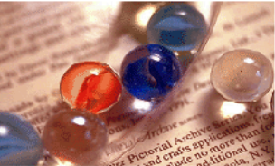
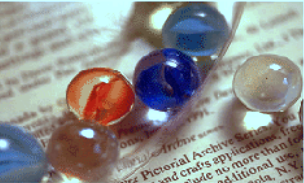
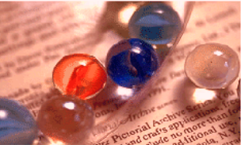
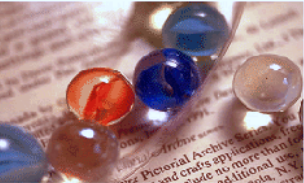
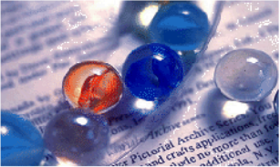
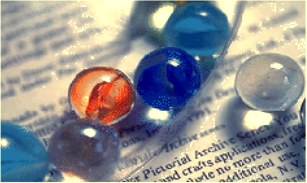
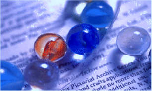
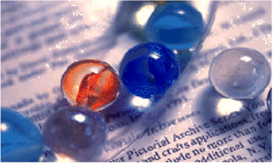

# Color Constancy

This Project is developed as part of [PyTorch Scholarship Challenge from Facebook](https://www.udacity.com/facebook-pytorch-scholarship), for the side project
contest.

It uses simple mlp to improve accuracy of low-level statistics-based methods while maintaining their high speed.

## Literature

[Color constancy](https://ipg.fer.hr/ipg/resources/color_constancy?) is the ability of the human visual system that ensures the perception of the color of objects to remain relatively constant under varying illumination conditions. In achieving computational color constancy it is necessary first to estimate the scene illumination and then to perform the chromatic adaptation, which adjusts the scene colors so that they look as they would under a desired illumination (mostly daylight).

Many color constancy methods are developed that form at least two groups.
The first group is formed of low-level statistics-based methods like [Grey-world (GW), MAX-RGB and Grey-Edge (GE)](https://staff.science.uva.nl/th.gevers/pub/GeversTIP07.pdf).
The second group is formed of learning-based methods and while they produce more accurate results they are slower than statistics-based methods.

Some voting methods have been proposed like [Color Dog](https://ipg.fer.hr/_download/repository/Color_Dog_-_Guiding_the_Global_Illumination_Estimation_to_Better_Accuracy.pdf) were it chooses the most appropriate center(illumination) by performing a voting where the voters are some existing illumination estimation methods that cast a vote of different strength for each of the available centers. Since both the methods’ illumination estimations and the centers are vectors, the vote that each of the used methods casts for each of the centers can be defined as the cosine of the angle between the center and the method’s illumination estimation. The center with the maximum sum of the votes is the proposed method’s illumination estimation.

## Our project

Motivated by these voting methods, we developed a simple multi-level perceptron network that produces a new illuminant estimation based on the weighted votes of simple fast statistics-based methods. The project is in its very early stages and has a long way to go.

## Results

We implemented 3 statistics-based methods which are GW, MAX-RGB and GE. We ran them on [SFU Grey-ball Set](http://www.cs.sfu.ca/~colour/data/gray_ball/index.html) and got 3 illuminations for each image, these illuminations were used later as features(input) for our mlp. We then used 80% of the dataset for training, 10% for validating and last 10% for testing. Results show a reduced error in terms of mean and median. Our [model](res/model.pth) is available for recreating these results although labels(real illuminations) must be obtained from given dataset link since we don't own the set and aren't allowed to distribute it.


## Showcase

Since as stated the project in its very early stages, it's currently dataset oriented and preferred to be tested against mentioned dataset. However, we manage to provide some sample from outside of the dataset. These samples can be recreated via running [demo.py](demo.py):

```
$ python demo.py
```













## Getting Started

Clone repo:

```
$ git clone https://github.com/MinaSGorgy/Color-Constancy.git
```

### Prerequisites

* [NumPy](http://www.numpy.org/)
* [Matplotlib](https://matplotlib.org/)
* [scikit-image](https://scikit-image.org/)
* [SciPy ](https://www.scipy.org/)
* [PyTorch](https://pytorch.org/)

### Installing

TODO: explain

```
$ TODO: cmd
```

To test installation run [demo.py](demo.py)

```
$ python demo.py
```

## Running

For help run:

```console
$ python demo.py -h
usage: demo.py [-h] [-i IMAGES [IMAGES ...]] [-d DICT]

optional arguments:
  -h, --help            show this help message and exit
  -i IMAGES [IMAGES ...], --images IMAGES [IMAGES ...]
                        paths to input images
  -d DICT, --dict DICT  path to saved dictionary
```

Sample:

```console
$ python demo.py -i assets/tungsten.png assets/bluesky.png -d res/model.pth
```

Which is same if you run:

```
$ python demo.py
```

## Authors

* **Mina Sami** - [MinaSGorgy](https://github.com/MinaSGorgy)
* **Mahmoud Khaled** - [Mahmoud-Khaled-Nasr](https://github.com/Mahmoud-Khaled-Nasr)

## License

This project is licensed under the GPL License - see the [LICENSE](LICENSE) file for details

## Acknowledgments

* Ciurea, F. and Funt, B. "A Large Image Database for Color Constancy
Research," Proceedings of the Imaging Science and Technology Eleventh
Color Imaging Conference, pp. 160-164, Scottsdale, Nov. 2003.
